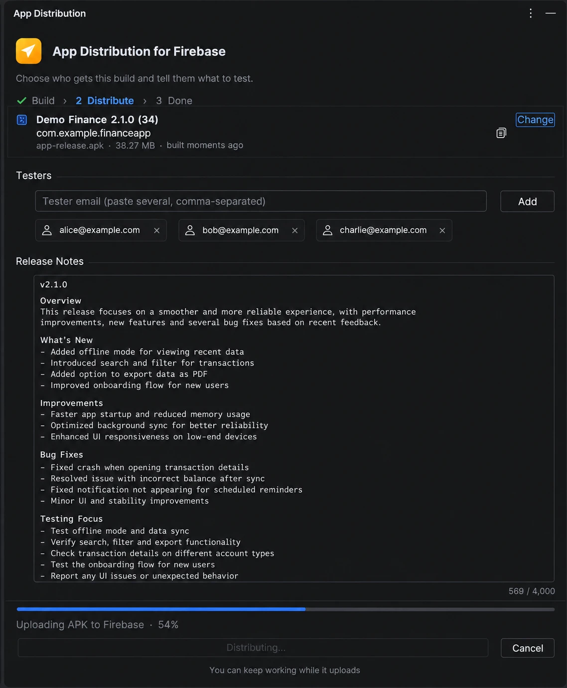

# App Distribution for Firebase

Send a test build to your testers without leaving Android Studio.

The plugin builds a signed release APK, uploads it to
[Firebase App Distribution](https://firebase.google.com/docs/app-distribution)
with your release notes, and emails your testers a download link. If you use
Slack, it can post the build to a channel too, so QA knows there's
something new to test.



I built it because shipping a test build meant the same chores every time:
build the APK, open the Firebase console, upload it, type the tester emails
again, paste the notes, then go tell the team in Slack. Now it's a couple of
clicks.

## What it does

The tool window walks you through three steps.

**1. Build.** One click builds a release APK of your app module, with the
same Gradle JDK Android Studio uses for the project. You can also skip the
build and send the last one, or any APK file you already have.

**2. Distribute.** Add testers and write release notes. The testers you used
last time are filled in for you, and recent ones are a click away. You'll
see upload progress as it happens, and you can cancel.

**3. Done.** Testers get an email from Firebase with a link to install the
build. You get a link straight to the release in the Firebase console.

Things it handles so you don't have to:

- **Product flavors and custom APK names.** If a build produces more than
  one APK, it asks which one to send.
- **Projects signed with the "Generate Signed App Bundle / APK" wizard.**
  It asks for your keystore once, fills in what Android Studio remembers,
  and keeps the passwords in the IDE's password store.
- **Firebase CLI.** It uses the `firebase` you already have, or downloads the
  standalone version for you. No Node.js needed. You sign in from the tool
  window.

## Install

**From the Marketplace:** in Android Studio, open
**Settings › Plugins › Marketplace**, search for
*App Distribution for Firebase*, and click **Install**.

**From a zip:** if you have the plugin zip (from [Releases](../../releases),
or [built yourself](#building-from-source)), use
**Settings › Plugins › ⚙ › Install Plugin from Disk…**

Then open the **App Distribution** tool window on the right side of the IDE.

### You'll need

- Android Studio Meerkat (2024.3) or newer
- A Firebase project with your Android app added, and its
  `google-services.json` in your app module (or in `src/<variant>/`)
- Release signing, either set up in Gradle or entered once in the plugin

## Your first build

1. Open your app project and the **App Distribution** tool window.
2. The **Firebase Account** row tells you if anything is missing.
   Click **Install** to get the Firebase CLI, then **Sign in**. A browser
   window opens; sign in with Google and paste the code back into the IDE.
3. Click **Build Release APK**.
4. Add tester emails. You can paste several at once, separated by commas.
5. Write what changed and what testers should look at, then click
   **Distribute**.

## Post builds to Slack

The plugin can announce every build in a Slack channel through an
[Incoming Webhook](https://api.slack.com/messaging/webhooks). It's off until
you set it up, and it takes about two minutes.

**Create the webhook in Slack**

1. Go to <https://api.slack.com/apps> and click **Create New App**, then
   **From scratch**. Give it a name like "App Distribution" and pick your
   workspace.
2. Open **Incoming Webhooks** and switch it **On**.
3. Click **Add New Webhook to Workspace**, choose the channel builds should
   go to, and click **Allow**.
4. Copy the webhook URL. It starts with `https://hooks.slack.com/services/`.

**Add it to the plugin**

1. Open **Settings › Tools › App Distribution for Firebase**.
2. Tick **Announce each distribution in Slack** and paste the URL.
3. Click **Send Test Message** to check it reaches the channel.

From then on, each build you distribute shows up with the app name, version,
build number, tester count, who sent it, your release notes and an
**Open in Firebase** button.

You can write release notes however you like. Headings such as
"What's new?" or "Bug fixes:" are shown in bold, and lines become a tidy
bullet list. Dashes, arrows, emoji bullets, checkboxes and `**markdown**`
are cleaned up, so notes look the same no matter who wrote them.

A webhook URL lets anyone who has it post to that channel, so the plugin
stores it in the IDE's password store and never writes it to a file.

## Troubleshooting

| You see | What to do |
|---|---|
| *Firebase CLI is not installed* | Click **Install** in the Firebase Account row. |
| *Not signed in* | Click **Sign in** and finish the login in your browser. |
| *The release APK is unsigned* | Your project signs builds with the wizard. Enter the keystore when the plugin asks, or add a `signingConfig` to your release build. |
| *No Firebase Android app with package …* | Add the app in the Firebase console and download a fresh `google-services.json`. |
| Upload fails with a permission error | Your Google account needs access to that Firebase project (Project settings › Users and permissions). |
| Slack test fails | Check that the URL starts with `https://hooks.slack.com/`. If the webhook was removed in Slack, create a new one. |

If you run into something else, please
[open an issue](../../issues) and include the error message.

## How it works

The plugin is the user interface. The actual work is done by
[`appdist`](https://github.com/jayrajsinhthakurinbox-code/app-distribution-cli),
a small command-line tool that ships inside the plugin and runs on the Java
that comes with Android Studio. It runs Gradle to build your app, calls the
Firebase CLI to upload, and posts to Slack if you've set that up. You can
also use it on its own from a terminal or CI.

## Building from source

Clone both repositories next to each other, because the plugin bundles the
CLI when it builds:

```bash
git clone https://github.com/jayrajsinhthakurinbox-code/app-distribution-cli.git
git clone https://github.com/jayrajsinhthakurinbox-code/app-distribution-plugin.git
cd app-distribution-plugin
```

```bash
./gradlew runIde        # opens a sandbox Android Studio with the plugin
./gradlew buildPlugin   # writes build/distributions/app-distribution-plugin-<version>.zip
```

The build uses your local Android Studio at `/Applications/Android Studio.app`.
Pass `-PandroidStudioPath=/path/to/Android Studio.app/Contents` if yours is
somewhere else.

When working on the CLI, set `APPDIST_CLI` to
`../app-distribution-cli/build/install/appdist/bin/appdist` in the run
configuration, and the plugin uses that build instead of the bundled one.

## Contributing

Bug reports, ideas and pull requests are welcome. For anything bigger than
a small fix, open an issue first so we can agree on the approach.

## License

[MIT](LICENSE)

---

*Not affiliated with or endorsed by Google. Firebase is a trademark of Google LLC.*
